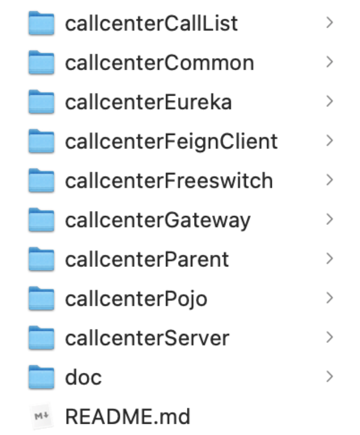

这不是一套完整的系统，需要配合业务系统一起使用，这里重点是java与Freeswitch以及业务端系统的协作整合，对业务系统及Freeswitch的承上启下。

给予 参考、思路、二次开发。免责，能力有限，不喜勿喷。

系统已在真实业务场景下稳定运行2年，这里开源非业务部分代码(这部分代码属于个人，本人评估确认过，谢谢提醒（访喷式备注！）)，不是为了推系统，或者其他商业目的。

纯为了供有需要的人参考，当时自己也是费了好大的劲才把这套系统搞出来的，网上相关资料不多，希望能对需要的人有所帮助。

如果有帮助，跪求star、follow me github

esl用的 https://github.com/zhouhailin/freeswitch-esl-all ，非常感谢。

沟通讨论交流，暂时先通过issues吧

通过接口文档可以一探系统可以支撑的业务功能 [呼叫中心接口文档](doc/呼叫中心接口文档.md)

一，系统架构图：

基础软件及其版本：
MySQL5.7(以上版本应该也行的)

Redis3及以上

Nginx(openresty，其他也行，自己弄)

JDK8（以上版本应该也没啥问题）

Maven3

FreeSWITCH1.6（其他版本就看各位的FreeSWITCH能力了，理论上跟本程序没有直接性兼容问题）

安装过程视系统环境差异，可能出现一些问题，遇到问题再根据具体问题情况具体解决

二，FreeSWITCH安装配置

1.安装FreeSWITCH
yum install -y yum-utils

yum install -y https://files.freeswitch.org/repo/yum/centos-release/freeswitch-release-repo-0-1.noarch.rpm epel-release

yum-builddep -y freeswitch

yum install -y yum-plugin-ovl centos-release-scl rpmdevtools git scl-utils autoconf automake libtool unixODBC unixODBC-devel libjpeg libjpeg-devel sqlite-devel curl-devel pcre-devel speex-devel ldns-devel libedit-devel devtoolset-4-gcc* libks alsa-lib-devel bison broadvoice-devel bzip2 libdb4-devel e2fsprogs-devel erlang flite-devel g722_1-devel gcc-c++ gdbm-devel gnutls-devel ilbc2-devel libcodec2-devel libcurl-devel libidn-devel libmemcached-devel libogg-devel libsilk-devel libsndfile-devel libtheora-devel libtiff-devel libuuid-devel libvorbis-devel libxml2-devel lua-devel lzo-devel mongo-c-driver-devel ncurses-devel net-snmp-devel openssl-devel opus-devel perl perl-ExtUtils-Embed pkgconfig portaudio-devel postgresql-devel python-devel soundtouch-devel unbound-devel wget which yasm zlib-devel libshout-devel libmpg123-devel lame-devel

scl enable devtoolset-4 'bash'

cd /usr/local/src

wget https://cmake.org/files/v3.13/cmake-3.13.3.tar.gz

tar -zxvf cmake-3.13.3.tar.gz

cd cmake-3.13.3

./bootstrap

gmake

make install

cd /usr/local/src

git clone -b v1.6 https://git.oschina.net/nwaycn/freeswitch.git

cd /usr/local/src/freeswitch

./bootstrap.sh -j

./configure --enable-portable-binary \
--prefix=/usr/local/freeswitch --localstatedir=/usr/local/freeswitch/var --sysconfdir=/usr/local/freeswitch/etc \
--with-gnu-ld --with-python --with-erlang --with-openssl \
--enable-core-odbc-support --enable-zrtp

修改modules.conf文件 把#formats/mod_shout改为formats/mod_shout

make -j

make -j install

make -j cd-sounds-install

make -j cd-moh-install

2.安装G729编码支持

1. cd /usr/local/src/freeswitch/src/mod/endpoints

2. git clone https://github.com/xadhoom/mod_bcg729.git

3. cd /usr/local/src/freeswitch，执行 ./configure

4. cd /usr/local/src/freeswitch/src/mod/endpoints/mod_bcg729，编辑Makefile修改

FS_INCLUDES=/usr/local/freeswitch/include/freeswitch

FS_MODULES=/usr/local/freeswitch/lib/freeswitch/mod

然后执行make

5. 编译完成后检查/usr/local/freeswitch/lib/freeswitch/mod目录下是否有mod_bcg729.so，没有的话 cp mod_bcg729.so 到该目录下

3.配置Freeswitch

1.用callcenter源码目录下的freeswitch目录下的etc替换/usr/local/freeswitch/目录下的etc目录(这里请根据自己的情况)

2.修改
/usr/local/freeswitch/etc/freeswitch/sip_profiles/internal.xml文件中的
<param name="ext-rtp-ip" value="改成服务器公网IP"/>
<param name="ext-sip-ip" value="改成服务器公网IP"/>

3.拷贝callcenter源码目录下的freeswitch目录下的
gen_dir_user_xml.lua到
/usr/local/freeswitch/share/freeswitch/scripts/目录下

4.拷贝callcenter源码目录下的freeswitch目录下的
*.mp3到
/usr/local/freeswitch/share/freeswitch/sounds/目录下

5.拷贝callcenter源码目录下的freeswitch目录下的
odbc.ini到系统/etc目录下

6.freeswitch需要用到的端口，请视环境而定是否需要配置防火墙或者安全组

7.替换/usr/local/freeswitch/etc/freeswitch/tls/目录下的wss.pem文件，该文件内容由ssl的.pem文件和.key文件合并而来，请根据要使用的域名生成

8.到/usr/local/freeswitch/bin目录下执行./freeswitch -nc -nosql 启动freeswitch实例，稍等片刻执行./fs_cli -p 'password'，如果出现如下画面则启动成功

如果需要停止则可以执行./fs_cli -p 'password'成功后，在该界面的命令行下执行shutdown

4.配置NFS共享目录
如果是在多台服务器上部署，则需要配置NFS共享。比如A机器部署业务程序，B部署Freeswitch，那么需要A机器能够访问到B机器的如下目录：

/usr/local/freeswitch/var/lib/freeswitch/recordings

/usr/local/freeswitch/etc/freeswitch/autoload_configs

/usr/local/freeswitch/etc/freeswitch/sip_profiles/external

/usr/local/freeswitch/share

三，业务功能实现程序配置部署：

1.配置

程序源码目录:

这里只要介绍下callcenterCommon目录下的配置文件，数据库、Redis等都在该文件里配置，application-环境.yml即为配置文件，环境是指如开发（dev）、测试（uat）、生产（pro）这样的系统使用环境而定。

A.MySQL配置

配置分了三个模块，可以使用不同的数据库，目前使用的是同一个数据库

url: Mysql实例IP

port: mysql实例端口

userName: 数据库的访问账号名

password: 数据库的访问账号密码

dbName: 数据库名称

表结构在源码目录下的doc目录下，freeswitch和sysAuthInfo表需要数据初始化：

freeswitch表存的是Freeswitch实例的访问信息，供业务程序使用，callcenterServer启动时会读取该表

sysAuthInfo表存的是业务系统接口访问认证信息，callcenterGateway启动时会读取该表

B.Redis配置：

C.录音文件存储配置

D.业务系统回调接口地址配置

E.代码编译

编译需要用到JDK和maven，请确保编译的机器上已经安装，可以把源码传到服务器上编译，也可以在电脑上编译。打开命令行终端到callcenter源码的callcenterParent目录下执行mvn clean package后等待执行完成（首次编译应该会需要一些时间），出现如下图所示的内容表示编译完成。编译完成后在每个模块的目录下有部署需要用的jar包，如callcenterServer模块目录下的target目录中的callcenterServer.jar文件，当需要部署该模块时则需要把该文件上传到对应的部署目录，下面会有介绍。

2.部署

系统基于Java生态中的微服务框架SpringCloud实现，分模块便于维护扩展：有模块变更只需要重新部署该模块，其他不需要动。

上传callcenter源码目录下的application到服务器上，application目录下的每个目录里都有一个start.sh和stop.sh，两个脚本分别对应着该模块的启动和停止。在start.sh文件中指定了部署配置环境的参数PROFILE=xxx，该参数的值对应着前面提到的配置文件application-xxx.yml，可以视情况修改

源代码编译后上传需要部署的模块的.jar文件到对应的部署目录中，然后执行start.sh即可启动（如果不是首次部署，也就是说已经在启动着了，则先执行stop.sh，然后把旧的jar包删掉）

A.callcenterEureka：服务的注册与发现模块，其他模块需要依赖该模块，里面无具体的功能代码，不需要访问数据库，先于其他模块启动，一般情况下只要正常默默的运行着就行，不需要做什么维护操作；

B. callcenterGateway：服务的网关模块，所有请求都经过该模块来路由到其他的业务功能模块，端口为9090，使用nginx代理来访问。一般情况下只要正常默默的运行着就行，不需要做什么维护操作；

nginx配置如下：

域名及证书改为自己需要的

server {
listen       80;
listen       443 ssl;
server_name  xxx;

        ssl_certificate      xxx;
        ssl_certificate_key  xxx;

        ssl_session_cache    shared:SSL:1m;
        ssl_session_timeout  5m;

        ssl_ciphers  HIGH:!aNULL:!MD5;
        ssl_prefer_server_ciphers  on;

        location / {
            proxy_http_version 1.1;
            proxy_set_header Host $host;
            proxy_set_header X-Real-IP $remote_addr;
            proxy_set_header REMOTE_HOST $remote_addr;
            proxy_set_header X-Forwarded-For $proxy_add_x_forwarded_for;
            proxy_set_header X-Forwarded-Proto  $scheme;
            proxy_pass xxx;
            proxy_set_header Upgrade $http_upgrade;
            proxy_set_header Connection "Upgrade";
            proxy_read_timeout 300s;
            client_max_body_size 20M;
            client_body_buffer_size 2048K;
            fastcgi_buffer_size 1024K;
            fastcgi_buffers 32 256K;
            fastcgi_busy_buffers_size 1024K;
        }

}

C. callcenterFreeswitch：该模块主要封装了Freeswitch相关的数据库表的操作（userinfo、gateway），一般情况下只要正常默默的运行着就行，不需要做什么维护操作；

D. callcenterCallList：该模块主要封装了拉取呼叫列表的程序，一般情况下只要正常默默的运行着就行，不需要做什么维护操作；

E. callcenterServer：基本上系统的主要功能都在该模块里实现；日常维护日志查看主要是该模块。